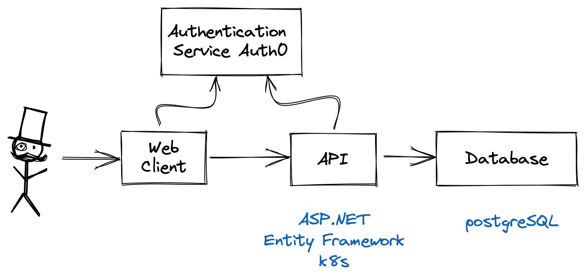

# Simple money 💰

## What is this?

>Software for managing personal finance with budgets.

*Yeah..., it's just another budget app* 😉 

I just wanted to replace my YNAB subscription and learn new stuff (architecture, asp.net, entity framework, authentication, kubernetes, and other stuff along the way)

# Roadmap

Q2-2022

- Backend Authentication (✔)
- Persistence (✔)
- Web-App registration and login
- Web-App simple basic features
  - manage bank accounts 
  - manage budget
  - manage income and spendings

# Feature ideas
- cli for fast entries
- no bank account sync but maybe a flexible csv import
- built in "flow" diagram, maybe something like a sankey diagram

# Technology

