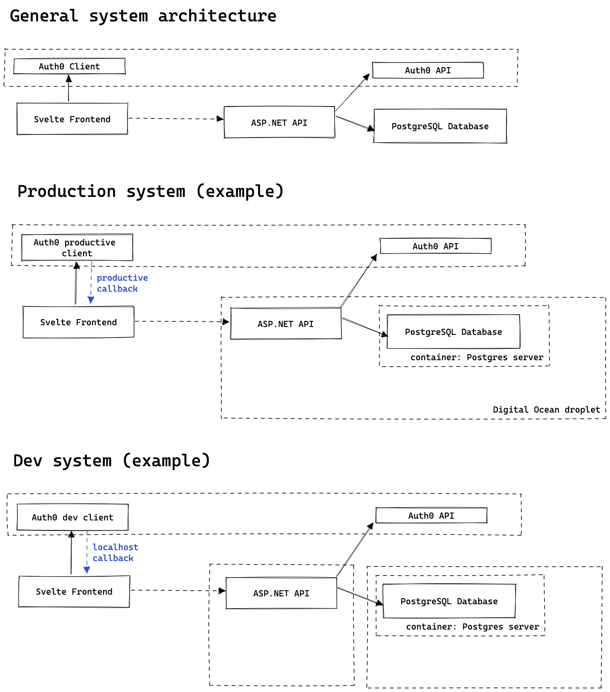

# cash flow 💰

Log and analyze income and spendings.

Software for managing personal finance with budgets.

# Architecture

Web app (sveltekit) that authenticates with Auth0 and interact with a API (ASP.NET) that store the data in a postgresql database.




# I wan't to develop local

Requirements:
- Auth0 account with configured API and Application
- Container environment (e.g. docker)


## Setup database

Add necessary configuration variables


1. run postgresql container 
    ```bash
    cd cashfllow-services/local-postgres
    docker-compose up -d
    ```
2. create and migrate datbase
   ```bash
   ./utility-cli migrate "Host=localhost;Port=5432;Database=postgres;Username=postgres;Password=postgres"  "~/Repositories/budget/cashflow-cli/Scripts"
   ```
   
## Get the API running

### IDE
1. Go to the `/backend/cashflow` folder 
2. Add necessary configuration for the ASP.NET API in `appsettings.json`
   - `ConnectionStrings:Database`
   - `Auth0:Domain`
   - `Auth0:Audience`

It's also possible to add these as environment variables.

Example: Environment variables via secret manager
1. Navigate to backend folder
2. `dotnet user-secrets set "ConnectionStrings:Database" "<connection-string>"`

### Container
You can use the `/backend/docker-compose.yml`to build and run the API. But you have to comment out the build step and insert the necessary environment variables.


## Get the frontend running

1. Go  to the `/frontend` folder
2. Add necessary configuration via environment variables (global or via `.env` file)
   - `VITE_AUTH_CLIENT_ID=<AUTH0_DASHBOARD>`
   - `VITE_AUTH_DOMAIN=<AUTH0_DASHBOARD>`
   - `VITE_BUDGET_API_SERVER=<CASHFLOW-API-ADDRESS>`


# I wan't do deploy this

## Database
It's up to you. Use a managed postgresql database or run your own database server.

## Backend
The Github CI build creates a docker image that can be published on DockerHub. My image is deployed to `velox1992/cashflow`.

You can use the `/backend/docker-compose.yml`to deploy the backend as docker container. 


## Frontend
There are a lot of possibilities. 
- Create vercel account, link repository and add environment variables.

